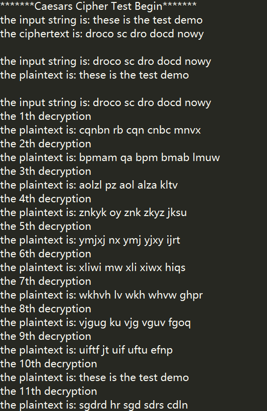
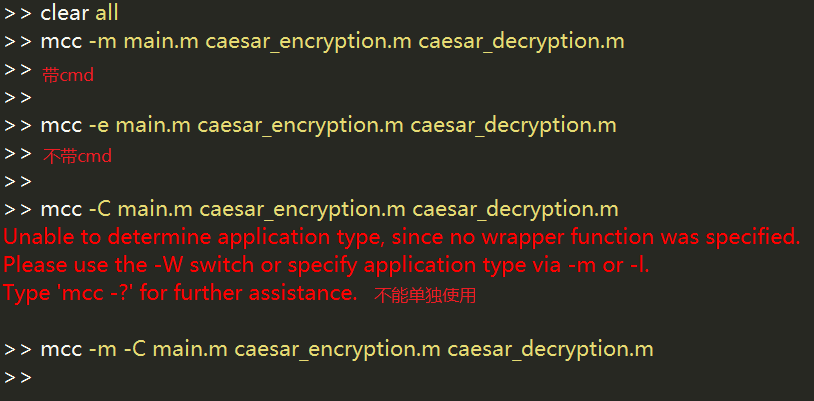
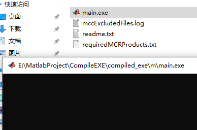
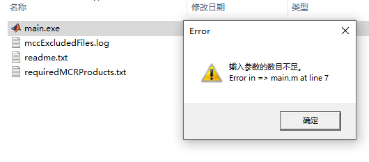
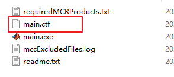
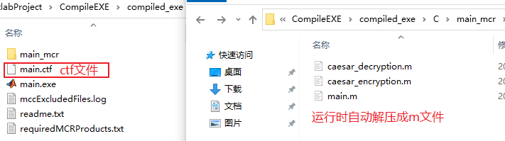
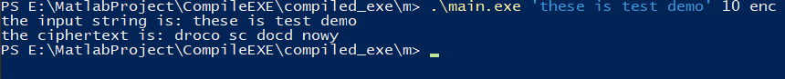
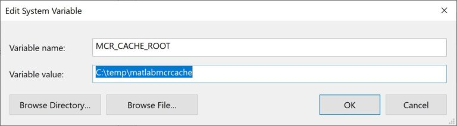

<div align='center' ><font size='70'>使用MCC编译EXE</font></div>

### 1 MCC编译过程

MATLAB编译器采用了Component Technology File（CTF）的存档方式来组织配置文件包，所有的M文件都运用高级加密标准（AES）进行了1024位密码的加密，并以CTF格式（.ctf）存储。读者可以在实际操作的过程中发现，任何一个由编译器产生的应用程序或者共享库均有一个与之对应的.ctf文件存档，其中当然也包括所有基于MATLAB的M文件和MEX文件。

MATLAB编译器生成的独立文件或组件的流程无须用户控制，是完全自动的。用户只需要提供一系列M文件程序作为构成应用程序。MATLAB编译器的基本编译流程如下：

- 相关性分析。确定用户提供的M文件、MEX文件和P文件上有关的所有函数，包括给定的文件要调用的所有M文件，以及M文件调用的文件，还包括所有的内部函数和MATLAB对象。

- 生成封装代码。生成建立目标组建所需要的所有源代码，包括以下内容。
  -  提供在命令行上的连接到M函数的C/C++代码。对于库和组件，这个封装文件包含所有生成的接口函数。
  -  一个组件数据文件，它包含运行时执行M代码所需要的信息。这些数据包括路径信息和加载保存在组建CTF档案上的M代码所需要的加密键。

- 建立CTF档案。在相关性分析期间建立的MATLAB可执行文件列表，被用来建立CTF档案，档案上包含运行时正确执行组件需要的文件。为了部署程序，这些文件被加密并压缩成一个单一的文件。目录信息也包含在档案上，以便目录下的内容正确地安装在目标机器上。

- C/C++编译，从封装代码生成阶段生成的C/C++文件被编译成目标代码。在mcc命令行上由用户提供的C/C++代码文件也在这时被编译。
- 连接。连接生成的目标文件与必要的MATLAB库，以建立最终的程序组件。用包含在MATLAB编译程序中的mbuild应用程序完成C/C++编译和连接两个过程。

在MATLAB中可使用mcc命令对MATLAB各类代码进行编译，具体用法如下：

```matlab
mcc [-options] fun [fun2 …]
```

- fun和fun2为MATLAB代码文件，最常用的几种格式如下:
  - mcc -m myfun：将M文件生成独立运行的同名exe文件。
  - mcc -m myfun1 myfun2：将M文件主函数生成可独立运行的同名exe文件。
  - mcc -W lib:liba -T link:lib a0 a1：将两个M文件生成名为liba的C共享库。
  - mcc -W cpplib:liba -T link:lib a0 a1：将两个M文件生成名为liba的C++共享库。

### 2 mcc命令用法

用户定义一个或多个MATLAB Compile编译选项给mcc命令，大部分的选项必须在左侧加上连字符，并且多个选项间用空格间隔开来。如在myfun1.m文件编译中，同时加入`-m`和`-g`这两个选项，使其在编译过程中同时进行除错操作。

- `-m`编译成自带cmd窗口，使用cmd打开时不会打印任何信息，报错会直接打印到cmd中：

```matlab
mcc –m –g myfun1.m myfun2.m
```

- 当选项没有使用到参数时，可以将编译选项聚集在一起，并且仅使用一个连字符即可：

```matlab
mcc –mg myfun1.m myfun2.m
```

- 如果选项是带有参数的，则必须将带有参数的选项列在所有选项的最后，这样在编译该选项时才是有效的。例如，假设-A的输入参数为full，则用户可以同时输入两个选项，并且中间以空格分开，但-A选项一定要放在后面：

```matlab
mcc –m –A full myfun1.m myfun2.m
```

- 或者也可以将带有参数的放在后面，并将选项放在一起，使用同一个连字符：

```matlab
mcc –m A full myfun1.m myfun2.m
```

- `–e`：编译成不自带cmd窗口exe，点击exe不会弹出cmd窗口，使用cmd调用时也时不会打印任何信息，报错会弹出对话框，只有手动确认才会关闭：

```matlab
mcc –e myfun1.m myfun2.m
```

- `-C` ：不将部署文件`CTF`打包进二进制文件，可单独使用(Do not embed the deployable archive in binaries.)，也可与其他命令一起使用：

```matlab
mcc -C myfun1.m myfun2.m
mcc –e -C myfun1.m myfun2.m
```

**注意：早期版本Matlab在打包生成exe可执行文件时 会生成mccExcludedFiles.log，ReadMe.txt，gui.ctf，gui.prj，gui_main.c，gui_mcc_component_data.c，gui.exe等CTF文件。 新版本的Matlab在生成exe时，把.ctf文件打包进了exe里，所以才找不到.ctf文件。加上-C这个选项可不将CTF文件打包进exe。****

### 3 实验

- 以凯撒密码加密和解密为例，将m文件编译为exe。依次使用不同的命令编译。



- 凯撒密码加密:`caesar_encryption.m`

```matlab
function ciphertext=caesar_encryption (plaintext,Key)
    %其中X表示明文，K表示密钥
    A=['z','a','b','c','d','e','f','g','h','i','j','k','l','m','n','o','p','q','r','s','t','u','v','w','x','y'];
    B=['Z','A','B','C','D','E','F','G','H','I','J','K','L','M','N','O','P','Q','R','S','T','U','V','W','X','Y'];
    L=length(plaintext);
    %获取明文的长度
    for i=1:L
        emp=abs(plaintext(i));
        %获取明文对应的ASCII码
        if (emp>=97 && emp<=123)
            %小写字母a到z的ASCII码是97~123
            for j=1:26
                if plaintext(i)==A(j)
                    %判断是哪一个小写的26个字母
                    n=mod(j+Key-1,26);
                    %由于是从z开始而不是从a开始所以要减1才是真正移动的位数
                    ciphertext(i)=A(n+1);
                end
            end
        elseif (emp>=65 && emp<=90)
            for j=1:26
                if plaintext(i)==B(j)
                    %判断是哪一个大写的26个字母
                    n=mod(j+Key-1,26);
                    ciphertext(i)=B(n+1);
                end
            end
        else
            ciphertext(i)=plaintext(i);
            %对标点和空格等其他字符保持原状
        end
    end
end
```

- 凯撒密码解密:`caesar_decryption.m`

```matlab
function plaintext=caesar_decryption(string,key)
    %其中string表示密文，key表示密钥
    A=['z','a','b','c','d','e','f','g','h','i','j','k','l','m','n','o','p','q','r','s','t','u','v','w','x','y'];
    B=['Z','A','B','C','D','E','F','G','H','I','J','K','L','M','N','O','P','Q','R','S','T','U','V','W','X','Y'];
    L=length(string);  
    %获取密文的长度
    for i=1:L
        emp=abs(string(i));
        %获取密文所有符号对应的ASCII码
        if (emp>=97 && emp<=123) 
            %小写字母a到z的ASCII码是97~123
            for j=1:26
                if string(i)==A(j)
                    %判断是哪一个小写字母
                    n=mod(j-key-1,26);
                    %由于是从z开始而不是从a开始所以要减1才是真正移动的位数
                    plaintext(i)=A(n+1);
                end
            end
        elseif (emp>=65 && emp<=90)
            %判断是哪一个大写字母
            for j=1:26
                    if string(i)==B(j)
                    %判断是哪一个大写字母
                    n=mod(j-key-1,26);
                    plaintext(i)=B(n+1);
                    end
            end
        else
            plaintext(i)=string(i);   
            %对标点和空格等其他字符保持原状
        end
    end
end
```

- main函数:`main.m`

```matlab
%%
% 通过把字母移动一定的位数来实现加密和解密。明文中的所有字母都在字母表上向后(或向前)按照一个固定数目进行偏移后被替换成密文。
% 例如，当偏移量是 3 的时候，所有的字母 A将被替换成 D，B 变成 E，以此类推 X 将变成 A，Y 变成 B，Z 变成 C。
% 由此可见，位数就是凯撒密码加密和解密的密钥。
%%
function reslsut=main(input_str,shift_nums,mode)
    fprintf('the input string is: %s\n',input_str);
    %str_len= length(input_str)
    if ~isempty(shift_nums)
        key=str2double(shift_nums);
    end
    if (mode =="enc")
        ciphertext=caesar_encryption(input_str,key);
        %调用caesar_encryption函数加密
        reslsut=ciphertext;
        fprintf('the ciphertext is: %s\n',ciphertext);
    elseif (mode =="dec")
        plaintext=caesar_decryption(input_str,key);
        reslsut=plaintext;
        fprintf('the plaintext is: %s\n',plaintext);
    elseif (mode=='vol_dec')
        plaintext=[];
        for key_index=1:26
            fprintf('the %sth decryption\n',num2str(key_index));
            plaintext=caesar_decryption(input_str,key_index);
            fprintf('the plaintext is: %s\n',plaintext);
        end 
        reslsut=plaintext;
    else
        fprintf('工作模式错误: mode=enc执行加密;mode=dec执行解密;mode==vol_dec暴力解密\n');
    end
end
```

- 使用`mcc -m`编译，exe自带cmd





- 使用`mcc -e`编译，exe不带cmd，出现错误会弹窗



- 使用`mcc -C`编译，CTF文件不打包进exe中，运行时会进行解压





- 调用exe，参数均以字符串格式接收，比如参数`10`，main函数实际接收到是字符串`'10'`



### 4 CTF

CTF的全称是component technology file，这是一种归档技术，通过它，matlab将可部署文件包装起来。需要注意的是，位于CTF归档文件中的所有M文件都采用了AES（Advanced Encryption Standard）进行加密，AES的对成密钥通过1024位的RSA密钥保护。除此之外，CTF还对归档进行压缩。显然，通过这种方式，可以只将可执行的应用程序库或者组件发布给终端用户，而保证源代码不被泄露。**Matlab Runtime运行Matlab编译成的exe文件 ，实际上会先将exe中的源码(m文件)、数据等相关CTF文件加压出来，然后运行.m文件。**

### 5 Speeding up compiled apps startup

实际，第一次运行Matlab编译成的exe时，加载速度会相当缓慢，一般情况大约需要**1分钟**。后续再次执行该exe时，速度将会显著变快，这是由于CTF文件在第一次运行时已解压。

**通常，MCR 和独立可执行文件在每次启动时在用户的临时目录中解压，并在用户注销时删除。显然，当设置 MCR_CACHE_ROOT 环境变量时，这些文件只会解压一次并保留以备后用。从理论上分析，这确实可能会显着加快已编译应用程序在后续调用中的启动时间。**经过实际测试，设置环境变量并不会显著提升启动速度，可能是设备原因。但是如果exe运行在服务器的等长期不关机的设备上，只在第一次启动时速度缓慢，后续不存在速度瓶颈。

- Linux设置MCR_CACHE_ROOT 

```shell
export MCR_CACHE_ROOT=/tmp/mcr_cache_root_$-- USER   # local to host
mkdir -p @MCR_CACHE_ROOT
./myExecutable
```

- Windows设置MCR_CACHE_ROOT 

```sehll
REM set MCR_CACHE_ROOT=%TEMP%
set MCR_CACHE_ROOT="C:\Documents and Settings\Yair\Matlab Cache\"
myExecutable.exe
```

- 如果想在 Windows 上永久设置此 env 变量，则可直接在系统环境变量增加该变量。



注意：设置 MCR_CACHE_ROOT 还可用于解决已部署应用程序中的其他性能瓶颈，如 MathWorks 技术解决方案的相关文章中所述。在相关问题中，当 Matlab 由于缺少权限而无法写入 MCR 缓存目录时，编译的 Matlab 可执行文件可能会因无法访问 MCR 组件缓存错误而失败。这可以通过将 MCR_CACHE_ROOT 设置为不存在的目录或具有全局访问权限的文件夹（/tmp 或 %TEMP% 通常是此类可写文件夹）来避免 。